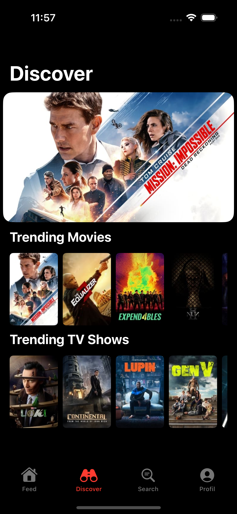

# TVBuddy

TVBuddy is an iOS app for tracking movies and TV series, powered by data from [The Movie Database (TMDb)](https://www.themoviedb.org).

   

## Features

TVBuddy helps you discover, track, and manage your favorite movies and TV series with ease. It offers a wide range of features, such as:

- Discover popular movies and TV series.
- Search for specific content on TMDb.
- Create and manage a watchlist.
- Mark content as watched and keep your viewing history up to date.

## Technologies

TVBuddy is built using the following technologies and tools:

- SwiftUI: For creating user interfaces and interactions.
- Combine: To handle asynchronous and event-driven code.
- SwiftData: A custom data management solution for storing user data.
- Swift Package Manager: To manage project dependencies.
- SwiftLint: A code style and conventions enforcer.
- SwiftUIPager: A library for creating paged views.
- Nuke: For efficient image loading and caching.
- The Movie Database (TMDb) API: To access movie and TV show data.

## Getting Started

To start using TVBuddy, follow these steps:

1. Clone this repository to your local machine.
2. Open the project in Xcode.
3. Build and run the app on your iOS device or simulator.
4. Enjoy exploring and tracking movies and TV series!

## License

This project is licensed under the [GNU General Public License v3.0](LICENSE).
